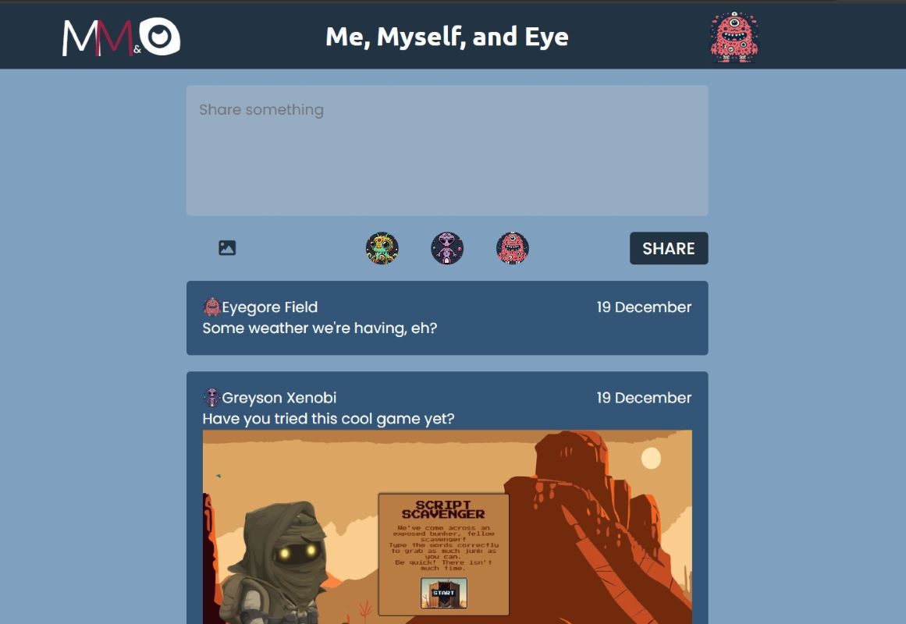

# Me, Myself, and I: Echo Chamber Project 
At its beginning, this project was one of the most ambitious projects. I've had to work through numerous challenges, but a great deal of my time on this project was spent developing structure. I have a User class, extended by a Subscriber class, as well as a Post class. This grants excellent control over the posts generated and tracking them over time. It has evolved into a themed project. Allow 
## Features
- User generated posts
- User can be changed with posts in their name. 
- Text and/or images can be posted
- Images are selected from user's documents
- A pop up module uses getter functions to display the user (and subscriber) information

## Badges

## Planned Features and Fixes
- Adapting local storage to maintain on user's local system
- Create theme chooser 